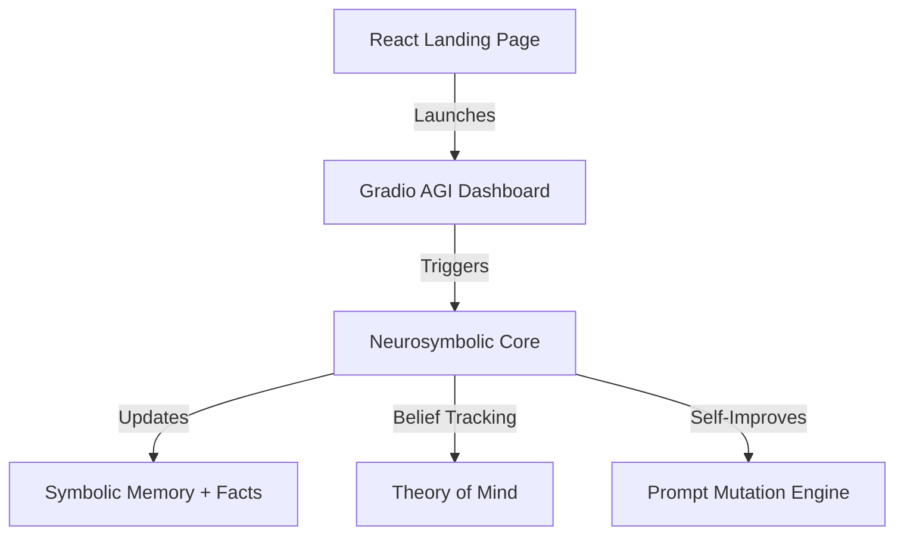

# README.md
# Project overview and setup instructions
# 🌐 Ooumph AGI Systems

Welcome to **Ooumph AGI Systems**, the world's most advanced autonomous AI software company simulator. This stack fuses symbolic reasoning, belief modeling, evolutionary learning, and interactive simulation into a unified AI execution engine.

---

## 🚀 Features

- 🧠 **Neurosymbolic Core** — Combines symbolic logic with neural language interfaces
- 🫀 **Theory of Mind Module** — Models agents' beliefs, intentions, and perspectives
- 🧬 **Evolutionary Layer** — Improves agent strategies and prompts through mutation + scoring
- 🧪 **Sandbox Deployment** — Safely tests reasoning inside constrained environments
- 🎛 **Gradio Dashboard** — Visual UI to simulate, test, and observe reasoning + belief states
- 🌐 **React Landing Page** — Public homepage for the company’s tech showcase

---

## 🧩 Architecture Diagram



---

## ⚙️ How to Run

### 1. Clone the Repo
```bash
git clone https://github.com/your-org/ooumph-agi.git
cd ooumph-agi
```

### 2. Install Dependencies
```bash
pip install -r requirements.txt
npm install  # if using landing page separately
```

### 3. Run Gradio AGI Dashboard
```bash
python agi_gradio_dashboard.py
```

### 4. Run the Landing Page (optional frontend)
```bash
npm run dev  # assumes Next.js or Vite setup
```

---

## 💡 Example Workflow

1. Enter: `"Alice is an admin and the request is valid"`
2. AGI will:
   - Convert natural language to symbolic facts
   - Infer `grant_access(alice)` using logic rules
   - Track beliefs about Alice
   - Mutate + evolve prompt strategies for better performance

---

## 📂 Directory Structure
```
/agi_gradio_dashboard.py        # UI + core connection
/neurosymbolic_core.py          # Symbolic reasoning engine
/theory_of_mind_module.py       # Belief graph manager
/evolutionary_learning_layer.py # Mutation + selection loop
/constrained_env_sandbox.py     # FastAPI sandbox API
/agi_integration_runner.py      # Full-stack runner
/ooumph_company_landing_page.js # React homepage
```

---

## 🛡️ Safety & Ethics
- All agents operate in isolated sandboxes
- Transparent belief modeling
- Explainable reasoning via symbolic logic
- Easily auditable decisions

---

## 🧠 Credits
Created by the Ooumph AI Engine — an AI that builds autonomous AI systems.

---

## 📜 License
MIT License — free for research, ethical deployment, and innovation.


